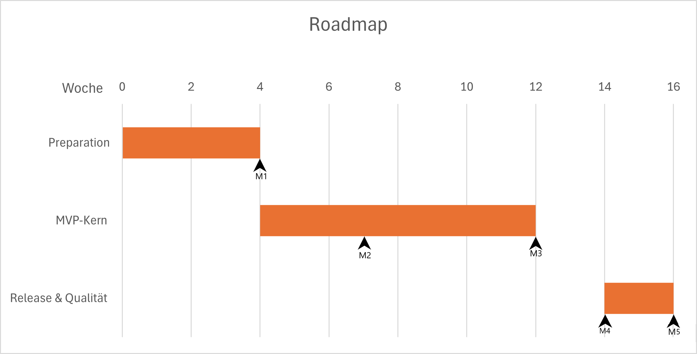

# 4.3 Zeitplan und Meilensteine

Dieses Kapitel beschreibt den zeitlichen Ablauf der Umsetzung der BlitzerApp auf Basis der in Kapitel 4.2
beschriebenen Arbeitspakete. Der Fokus liegt auf einem agilen Vorgehen mit festen Timeboxen (Sprints) und einer
phasenorientierten Planung. Der Zeitplan ist bewusst grob gehalten und versteht sich als Orientierung, die im Rahmen
von Backlog Refinements und Sprint-Planungen iterativ geschärft und angepasst wird.

Für alle weiteren Überlegungen wird von einem kleinen, cross-funktionalen Kernteam ausgegangen, das über die Phasen
hinweg möglichst stabil bleibt. Dieses Team umfasst einen Product Owner, zwei mobile Entwickler, eine UX/Design-Rolle
sowie eine QA-/Tester-Rolle. Ergänzend werden eine Privacy/Compliance-Beratung und eine
Community-Liaison-Funktion bedarfsorientiert eingebunden.

Im Gegensatz zu einem klassischen Projektplan werden keine einzelnen Arbeitspakete fest bestimmten Sprints
zugeordnet. Stattdessen wird für jede Phase auf Basis des erwarteten Durchsatzes dieses Kernteams eine realistische
Anzahl von Sprints geplant. Innerhalb einer Phase werden die priorisierten Arbeitspakete inkrementell aus dem
Product Backlog gezogen.

Zur Strukturierung werden folgende Phasen angesetzt (vgl. Kapitel 4.2):

- Preparation
- MVP-Kern
- AppStore-Release & Qualität
- Betrieb / Wartung (laufend)
- Erweiterungen

## 4.3.1 Phasen und geplante Sprintanzahl

Für die zeitliche Planung der BlitzerApp wird ein zweiwöchiger Sprint-Rhythmus angesetzt, in dem das oben
beschriebene Scrum-Team mit stabilen Kapazitäten arbeitet. Die in der nachfolgenden Übersicht genannten
Sprintzahlen je Phase leiten sich aus den geschätzten Aufwänden der in Kapitel 4.2 beschriebenen Arbeitspakete
sowie dem erwarteten Durchsatz dieses Teams pro Sprint ab. Es wird bewusst keine fixe Gesamtzahl an
Projektwochen vorab unterstellt; vielmehr ergibt sich die Dauer der Phasen indirekt aus der Anzahl der benötigten
Sprints und deren inhaltlicher Füllung. Auf dieser Grundlage ergibt sich insgesamt ein Zeitraum von rund 18–20
Wochen für den initialen Umsetzungszyklus bis einschließlich des ersten Erweiterungszyklus.

Zur Konkretisierung der Sprintplanung werden die in Kapitel 4.2 aufgeführten Arbeitspakete mit ihren
Aufwandsklassen (S, M, L) auf eine einfache Punkteskala abgebildet (z. B. S ≈ 3 Punkte, M ≈ 5 Punkte, L ≈ 8 Punkte).
Auf Basis vergleichbarer Projektkonstellationen wird für das hier betrachtete Kernteam ein Durchsatz von etwa
18–22 dieser Aufwandspunkte pro zweiwöchigem Sprint angenommen. Summiert man die so bewerteten
Arbeitspakete je Phase, ergeben sich gerundet die in der folgenden Tabelle
angegebenen Sprintzahlen. Die Abweichung zwischen rechnerischem Minimum und geplanter Sprintanzahl dient bewusst als
Puffer für Schätzunsicherheiten, Integrationsaufwände und Feedbackschleifen aus Tests und Beta-Phase.

| Phase                            | Geplante Dauer           | Geschätzte Anzahl Sprints | Inhaltlicher Schwerpunkt                                                 |
|----------------------------------|--------------------------|---------------------------|--------------------------------------------------------------------------|
| Preparation                      | ca. 4 Wochen             | 2 Sprints                 | Verfeinerung Anforderungen, Architekturklärung, Projekt-Setup            |
| MVP-Kern                         | ca. 6–10 Wochen          | 4–5 Sprints               | Umsetzung der Must-have-Funktionalität (MVP)                             |
| AppStore-Release & Qualität      | ca. 4 Wochen             | 2 Sprints                 | Testautomatisierung, Beta-Phase, Store-Vorbereitung, Release-Kandidat    |
| Erweiterungszyklen (fortlaufend) | je ca. 4 Wochen          | je 2 Sprints (iterativ)   | Priorisierte Erweiterungen in Zyklen auf Basis von Feedback & Monitoring |
| Betrieb / Wartung (laufend)      | fortlaufend nach Release | nicht fest begrenzt       | Fehlerbehebung, Monitoring, kontinuierliche Verbesserungen               |

Die Phase „Betrieb / Wartung“ wird nicht in eine feste Sprintanzahl überführt, da sie im Sinne eines lebenden
Produkts als kontinuierlicher Prozess verstanden wird. In der Praxis findet auch Wartung in Sprints statt, im Rahmen
kongruenter Team-Sprints; für die hier betrachtete Planung wird sie jedoch nur grob als laufender Post-Release-
Prozess markiert. Die Erweiterungszyklen können je nach Bedarf und Ressourcenplanung mehrfach wiederholt werden,
um den Funktionsumfang der App schrittweise zu erhöhen. Jede Erweiterungsphase sollte mindestens ein neues
Release (z. B. 1.1, 1.2) ermöglichen. Die Anzahl der Erweiterungszyklen hängt von den verfügbaren Ressourcen und
dem Nutzerfeedback ab.

## 4.3.2 Meilensteine

Die Meilensteine werden im Folgenden nicht einzelnen Sprints, sondern den Phasen und groben Kalenderwochen
zugeordnet. Sie markieren jeweils einen klar definierten Produktzustand, der für Stakeholder nachvollziehbar ist. Ihre
zeitliche Einordnung orientiert sich an der in Abschnitt 4.3.1 beschriebenen Sprintanzahl pro Phase und dem dort
angenommenen Durchsatz des Kernteams.

| Meilenstein                                 | Voraussichtlicher Zeitraum                                                                       | Arbeitspakete                                                                                                                                                                            | Ergebnis                                                                                                                                                                                                                   |
|---------------------------------------------|--------------------------------------------------------------------------------------------------|------------------------------------------------------------------------------------------------------------------------------------------------------------------------------------------|----------------------------------------------------------------------------------------------------------------------------------------------------------------------------------------------------------------------------|
| M1: Grundlagen \& Architektur abgeschlossen | Ende der Phase Preparation (ca. Ende Woche 4; nach 2 Sprints)                                    | AP\-A1 (Refinement der MVP\-Anforderungen), AP\-A2 (Architektur\-Validierung), AP\-A3 (Setup Entwicklungsumgebung \& Projektgerüst)                                                      | Abgenommene, priorisierte Anforderungsliste, validierte Architektur und funktionsfähiges Projektgerüst; Start der Umsetzung des MVP\-Kerns möglich.                                                                        |
| M2: Technischer MVP\-Kern steht             | Erstes Drittel der MVP\-Phase (ca. Mitte bis Ende Woche 6; nach 1–2 MVP\-Sprints)                | AP\-B1 (Standortbestimmung), AP\-B2 (Overpass\-Abfrage \+ Parser), AP\-B3 (Kartenintegration)                                                                                            | Technische Grundlage für die Kernfunktionen (Positionsermittlung, Abruf und Darstellung von Blitzern auf der Karte) ist vorhanden; erste inter­ne Tests und Feedbackschleifen sind möglich.                                |
| M3: MVP funktionsfähig (intern nutzbar)     | Ende der MVP\-Phase (ca. Woche 10; nach 4–5 MVP\-Sprints)                                        | AP\-B4 (Warnlogik), AP\-B5 (Disclaimer \& Datenschutzinfo), AP\-B6 (POI\-Overlay \& Cache), AP\-B7 (Geofencing)                                                                          | Alle für den MVP definierten Must\-have\-Funktionen sind umgesetzt; die App ist intern nutzbar und kann von einem begrenzten Nutzerkreis (z\. B\. Projektteam, ausgewählte Tester:innen) erprobt werden.                   |
| M4: Beta\-Release \& Qualitätssicherung     | Mitte der Phase AppStore\-Release \& Qualität (ca. Woche 12; nach 1 Sprint in dieser Phase)      | AP\-R1 (Testautomatisierung Ausbau), AP\-R2 (Beta\-Test \& Feedback\-Auswertung)                                                                                                         | Stabile Beta\-Version liegt vor; wichtigste Testfälle sind automatisiert abgedeckt; strukturiertes Nutzerfeedback zu Stabilität und Usability liegt vor und fließt in das Product Backlog ein.                             |
| M5: AppStore\-Release 1\.0                  | Ende der Phase AppStore\-Release \& Qualität (ca. Ende Woche 14; nach 2 Sprints in dieser Phase) | AP\-R3 (App\-Store Vorbereitung), AP\-R4 (Release\-Kandidaten \& Final Review), Start AP\-W1 (Fehlerbehebungen / Patch\-Zyklus)                                                          | Version 1\.0 ist in den relevanten Stores veröffentlicht; regulärer Wartungsprozess ist etabliert; erste reale Nutzungsdaten und Fehlerberichte fließen in die weitere Planung ein.                                        |
| M6: Stabilisierung \& erste Erweiterungen   | Ende des ersten Erweiterungszyklus (ca. Woche 18; nach 2 Erweiterungssprints)                    | AP\-W1–W3 (Wartung, Monitoring, Feedback\-Auswertung), AP\-E1 (Offline\-Grundfunktion), AP\-E3 (Einstellungen), optional: AP\-E2 (OSM Notes), AP\-E4 (Performance \& Energieoptimierung) | App ist im laufenden Betrieb stabilisiert; erste Erweiterungen erhöhen den praktischen Nutzen für die Nutzer:innen (Release 1\.1); auf Basis von Monitoring\- und Feedback\-Daten werden nächste Ausbaustufen vorbereitet. |

Durch die Verortung der Meilensteine auf Phasen- und Zeitachsen-Ebene wird ein klarer Rahmen geschaffen, ohne die
agile Flexibilität der Sprintplanung einzuschränken. Die Verbindung zu den in Kapitel 4.2 definierten Arbeitspaketen
bleibt dabei transparent und nachvollziehbar.

## 4.3.3 Puffer und Gesamtdauer

Die geplante Gesamtdauer des initialen Umsetzungszyklus im engeren Sinn (Preparation bis AppStore-Release 1.0)
beträgt ungefähr 14–16 Wochen. Die darüber hinausgehenden Erweiterungszyklen werden bewusst nur grob
skizziert und nicht mehr als Teil der initialen Umsetzung gewertet. Puffer werden explizit auf Phasenebene und nicht
auf Ebene einzelner Arbeitspakete modelliert.

**Pufferannahmen:**

- Innerhalb der Phase MVP-Kern wird ein Sprint als impliziter Puffer verstanden (d. h. Planung mit 4–5 statt exakt 4
  Sprints), um mit Schätzunsicherheiten und variierendem Durchsatz umgehen zu können.
- Die Phase AppStore-Release & Qualität enthält zeitlichen Spielraum für unvorhergesehene Verzögerungen im
  App-Store-Prozess oder bei der Behebung kritischer Befunde aus dem Beta-Test. Die zwei hierfür vorgesehenen
  Sprints werden bewusst nicht auf Kante mit Arbeitspaketen gefüllt, um auf Durchsatzschwankungen reagieren zu
  können.
- Erweiterungszyklen nach Release 1.0 (z. B. für Version 1.1, 1.2) werden jeweils in eigenen, zweiwöchigen
  Sprint-Zyklen geplant. Sie dienen als zusätzlicher zeitlicher Puffer für nachgelagerte Anpassungen und neue
  Funktionalität, sind aber nicht Bestandteil der hier betrachteten initialen Umsetzung bis Version 1.0.

**Gesamtbetrachtung (initiale Umsetzung bis Release 1.0):**

- Preparation: ca. 2–4 Wochen (1–2 Sprints)
- MVP-Kern: ca. 6–10 Wochen (4–5 Sprints)
- AppStore-Release & Qualität: ca. 4 Wochen (2 Sprints)

Damit ergibt sich für die initiale Umsetzung bis zur Veröffentlichung der Version 1.0 ein realistischer, aber bewusst
nicht überdeterminierter Zeitplan im Rahmen von etwa 14–16 Wochen. Er bildet einen klaren Rahmen für die
Hausarbeit, lässt aber genügend Flexibilität für eine agile Umsetzung mit sich verändernder Backlog-Priorität. Die
anschließenden Erweiterungszyklen werden ergänzend betrachtet, um die langfristige Weiterentwicklung der App
aufzuzeigen, ohne den Kernzeitplan künstlich zu verlängern.

## 4.3.4 Roadmap

Anstelle eines detaillierten Gantt-Diagramms mit Sprint- und Paketzuordnung wird eine vereinfachte zeitliche Roadmap
verwendet. Diese stellt dar, zu welchem ungefähren Zeitpunkt die einzelnen Phasen und Meilensteine liegen. Grundlage
ist ein Projektstart in Woche 1 und ein zweiwöchiger Sprint-Rhythmus.

Bei der Darstellung steht die agile Idee im Vordergrund, dass pro Phase jeweils die aktuell wichtigsten, priorisierten
Backlog-Einträge gezogen werden, solange die übergeordneten Zeitboxen (Sprints und Phasen) und Meilensteine im
Rahmen des angenommenen Durchsatzes eingehalten werden.

Nach Abschluss der Veröffentlichung der Version 1.0 wird die Roadmap im Rahmen der laufenden Phase Betrieb/Wartung
und Erweiterungen kontinuierlich aktualisiert. Auf Basis der realen Nutzungsdaten, des Monitorings und der systematischen
Auswertung von Community‑Feedback werden weitere Erweiterungszyklen geplant, in denen ausgewählte Arbeitspakete
aus dem Erweiterungs‑Backlog iterativ umgesetzt werden. Zum jetzigen Zeitpunkt ist eine detailliertere Planung dieser Zyklen
nicht sinnvoll, da Umfang und Priorität der Erweiterungen wesentlich vom späteren Nutzerfeedback und den im
Betrieb sichtbaren Nutzungsmustern abhängen. Die Roadmap bleibt damit ein lebendes Artefakt, das den groben Rahmen der
Phasen und Meilensteine aus Abschnitt 4.3 abbildet, ohne die für das agile Vorgehen erforderliche Flexibilität in der
inhaltlichen Ausgestaltung der Sprints einzuschränken.
